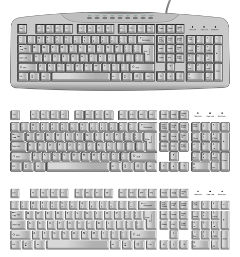

## Free Keyboard Graphics and Key Icons for Screencasts

Created by [Kai Noack](http://stackoverflow.com/users/1066234/kai-noack)

Version  	1.0 - Date 2014-07-07

Do you need keys from a keyboard as SVG and PNG graphics? Here you go, I created a full set of keys (blank and bordered) in 200 dpi, 300 dpi and 400 dpi resolutions. In other words, you get many different sizes that will suit your needs. You also find a complete keyboard as SVG and PNG in different versions included. And the best thing: Everything is for free, public domain :)

### Primary source

Original keyboard SVG from http://commons.wikimedia.org/wiki/

File: Computer\_keyboard\_US.svg

Derivative work by http://www.speedflips.com

English:	Computer keyboard with US layout. Some details inherited from the prototype may be missing or inadequate on real keyboards, so fix it.

Date:		2010-08-23 13:55 (UTC)

Source: 	Computer\_keyboard\_Danish\_layout.svg

Author:  	Computer\_keyboard\_Danish\_layout.svg: Mysid
derivative work: Incnis Mrsi (talk)

###License: Public Domain - Free for commercial and private use  

I, the copyright holder of this work, hereby publish it under the following license:

Public domain 	I, the copyright holder of this work, release this work into the public domain. This applies worldwide.

In some countries this may not be legally possible; if so:
I grant anyone the right to use this work for any purpose, without any conditions, unless such conditions are required by law.

### Note

I am using the keys for all screencast videos I am doing for speedflips com and overlay my tutorial videos with these shortcut graphics. Check out [one of the videos](https://www.youtube.com/user/speedflips) to get an idea.

For my screencasts in size 1280 x 720, I am using the **300 dpi versions**.

If you have any suggestions for improving the graphics, comment in the github repo.

Have fun and do good! ~~ Kai

